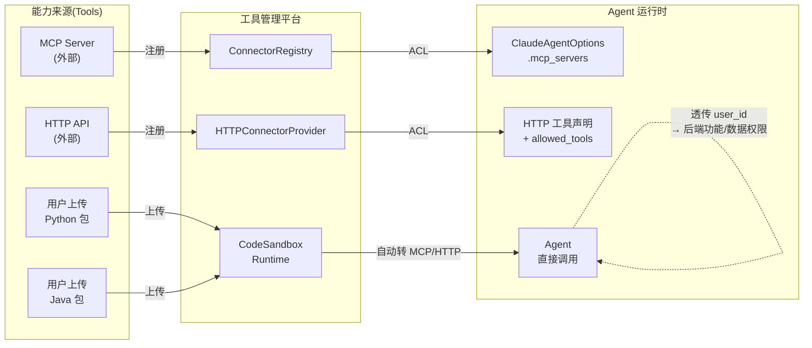
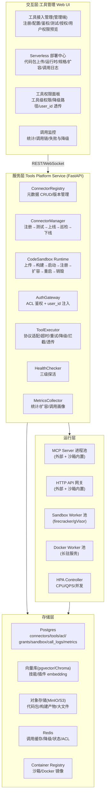
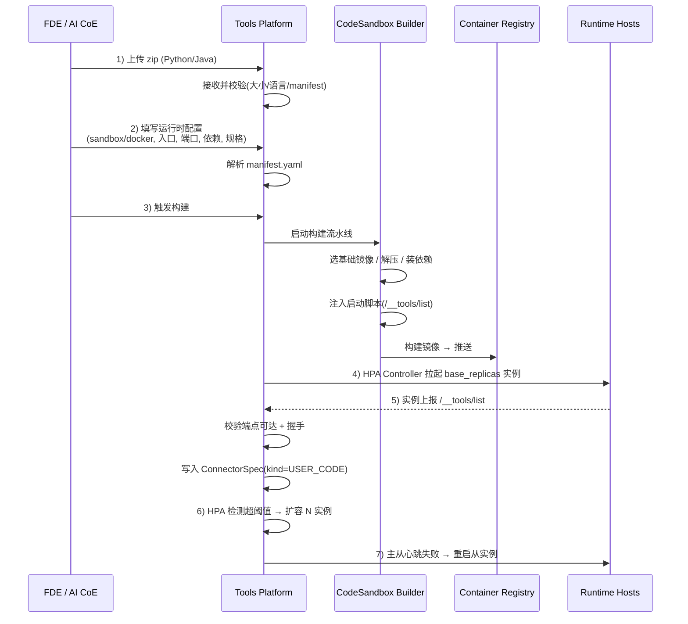
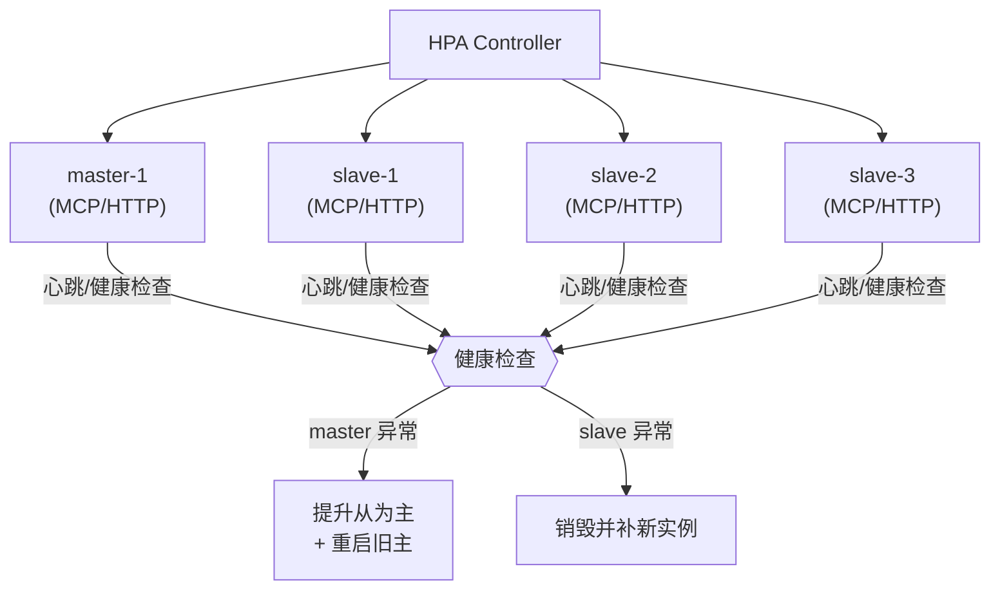
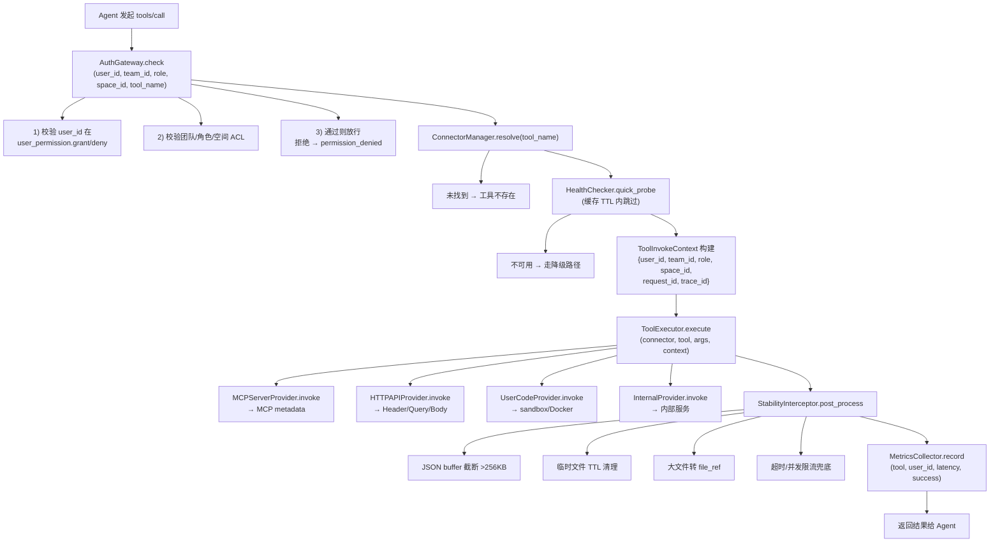
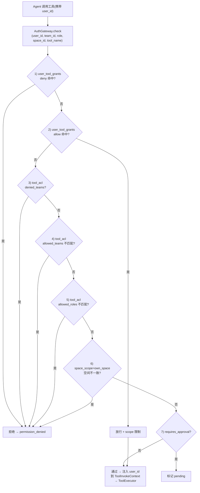
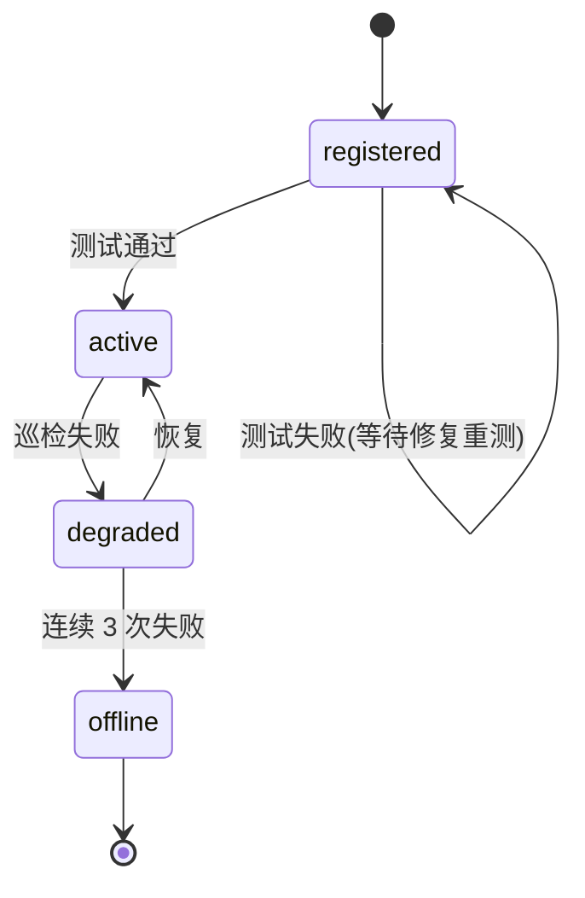
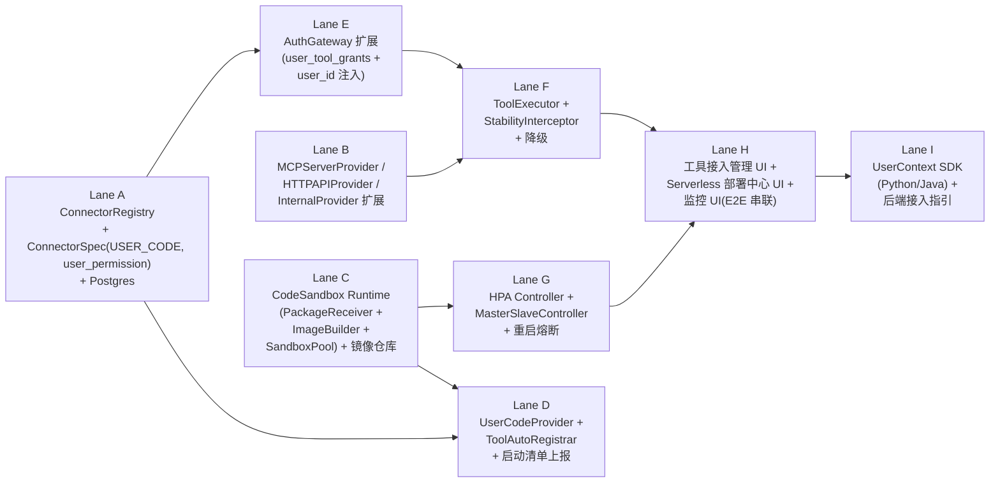

# goktech-agents 工具管理平台（Tools Platform）技术方案

> 版本：v2.0
> 日期：2026-06-04
> 定位：售前/方案级技术方案
> 关联文档：《goktech-agent 产品需求文档（PRD）》（同目录 `goktech-agents-prd.md`）、多智能体团队系统技术方案（同目录 `multi-agent-team-tech-design.md`）、数据工作台技术方案（同目录 `data-platform-tech-design.md`）、知识工作台技术方案（同目录 `knowledge-platform-tech-design.md`）
> 覆盖需求：KR4（技能/插件/command 搜索的消费端）、KR6（权限治理）、KR13（外部连接器接入管理）、7.1.1「工具接入管理」页面、7.2.4「工具、技能与插件」、7.3.1 工具能力要求、7.3.2 稳定性与可运营性
> 范围变更（v1.0 → v2.0）：本模块"工具（Tools）"专指 **MCP Server** 与 **HTTP API** 两类外部能力来源（不含 Skills/Plugins/Commands 的注册、发现与编排，这些由技能插件中心与多智能体系统承载）。新增 **Serverless 代码沙箱运行时**，支持上传 Python/Java 代码包即生成托管工具；新增 **用户身份贯通**，实现细粒度功能权限与数据权限。

---

## 1. 概述

工具管理平台是 goktech-agent 平台「工具」主线的承载模块，职责是**统一注册、托管、授权、调用和治理 Agent 可调用的外部能力来源——即 MCP Server 与 HTTP API**。它提供完整的"代码→部署→注册→授权→调用→治理"闭环，让 FDE 既能复用既有 MCP/API，也能通过上传代码包快速生成可托管的工具。



### 1.1 核心职责（对齐 PRD 7.2.4、7.3.1）

| 能力                                  | PRD 要求                                                            | 本版范围                                                                 |
| ------------------------------------- | ------------------------------------------------------------------- | ------------------------------------------------------------------------ |
| 外部连接器注册                        | MCP Server / HTTP API / 内部系统 API 注册、连通性测试、鉴权配置     | **必须支持**（本模块核心）                                         |
| Serverless 工具部署                   | 上传 Python/Java 代码 zip → sandbox/Docker → 暴露 MCP 或 HTTP API | **v2.0 新增，必含**                                                |
| 工具权限与降级                        | 工具级权限、降级路径、错误提示                                      | **必须支持**，并扩展为基于 user_id 的细粒度管控                    |
| 用户身份贯通                          | 平台默认将 user_id 注入每次工具调用，透传到后端 MCP/API             | **v2.0 新增，必含**                                                |
| 稳定性治理                            | JSON buffer、临时文件清理、大文件上传                               | **必须支持**（在网关层统一拦截）                                   |
| 调用统计                              | 次数、成功率、延迟、token 消耗                                      | **必须支持**                                                       |
| `/command` 搜索、技能分类、插件搜索 | KR4                                                                 | **不在本模块**（由技能插件中心承载），Tools 仅暴露工具清单供其消费 |
| 技能沉淀、插件安装                    | 7.2.4                                                               | **不在本模块**                                                     |

### 1.2 设计取舍（关键决策）

| 决策点            | 选择                                                                                                   | 理由                                                                                                     |
| ----------------- | ------------------------------------------------------------------------------------------------------ | -------------------------------------------------------------------------------------------------------- |
| Tools 范围边界    | **只含 MCP Server 与 HTTP API**                                                                  | Skills/Plugins/Commands 的注册、发现、编排由对应模块承载；Tools 专注"外部能力"全生命周期，避免职责重叠   |
| 工具协议统一      | **MCP 为标准协议，HTTP API 走声明式映射**                                                        | MCP 与 Claude Agent SDK `mcp_servers` 原生对接；HTTP API 走工具映射表（`HTTPToolMapping`）统一为工具 |
| 部署形态          | **三类来源**：①外部托管 MCP/API（直连）②用户上传代码 → Serverless 沙箱 ③平台内置内部系统 API | 满足"既能复用既有能力，也能 0→1 快速生成"的现场需求                                                     |
| Serverless 运行时 | **sandbox + Docker 双形态**，可动态扩容、主从重启                                                | Sandbox 适合轻量短任务（默认 ≤60s），Docker 适合长驻服务；二者统一通过 `CodeRuntime` 抽象             |
| 容器化运行时      | **每个 tool 一个独立 sandbox/Docker 实例**，主备至少 1+1                                         | 故障隔离 + 平滑重启；性能不足时按 HPA 规则横向扩容实例数                                                 |
| 用户身份贯通      | **user_id 透传到 MCP/API 后端**                                                                  | 平台在调用网关层统一注入（Header + Payload）；后端按 user_id 实施功能/数据权限                           |
| 授权模型          | **团队/角色/空间三维 ACL + user_id 细粒度过滤**                                                  | 既有三维 ACL 控制"是否可用"，user_id 透传控制"使用时可做什么、看哪些数据"                                |
| 降级策略          | **工具级降级声明 + 平台级 fallback**                                                             | 工具注册时声明降级路径（cache/alternative_tool/retry/error_message），调用失败时平台自动切换             |
| 连通性测试        | **注册时强制 + 周期巡检 + 调用前快速探活**                                                       | 三级探活保证 Agent 不会因工具不可用而卡死                                                                |
| 稳定性治理        | **平台层统一拦截**                                                                               | JSON buffer 溢出、临时文件泄漏、大文件上传等问题在工具调用网关层统一治理                                 |

---

## 2. 总体架构

### 2.1 架构分层



### 2.2 组件职责

| 组件                    | 职责                                                                                                                 | 长任务               |
| ----------------------- | -------------------------------------------------------------------------------------------------------------------- | -------------------- |
| `ConnectorRegistry`   | MCP Server / HTTP API / 内部 API 元数据 CRUD、<br />版本管理；**不**承担 skills/plugins 的注册                 | 否                   |
| `ConnectorManager`    | 连接器生命周期：注册→连通性测试→上线→周期巡检→下线；<br />维护 `ConnectorProvider` 实例池                      | 是（测试/巡检异步）  |
| `CodeSandbox Runtime` | **v2.0 新增**：代码包上传→构建镜像→启动 sandbox/Docker→<br />自动注册为 MCP/HTTP 工具；横向扩缩容；主备重启 | 是（构建、扩容异步） |
| `AuthGateway`         | 工具调用前 ACL 校验：用户所属团队/角色/空间 + <br />user_id 工具级显式授权 + user_id 透传封装                        | 否                   |
| `ToolExecutor`        | 统一调用网关：MCP 协议适配、HTTP 超时/重试、降级 fallback、<br />稳定性拦截、**user_id 透传**                  | 否（同步调用）       |
| `HealthChecker`       | 三级探活：注册时强制测试、周期巡检、调用前快速探活                                                                   | 是（巡检异步）       |
| `MetricsCollector`    | 工具调用次数、成功率、延迟、token 消耗、用户级调用画像                                                               | 否                   |

### 2.3 数据流（端到端）

```mermaid
flowchart TB
    subgraph REG["外部连接器注册流程(管理端)"]
        R1["1) 注册<br/>填写 ConnectorSpec"] --> R2["2) 测试<br/>HealthChecker 连通性"]
        R2 --> R3["3) 上线<br/>持久化/ACL/索引"]
        R3 --> R4["4) 巡检<br/>周期巡检/异常告警"]
    end
    subgraph DEP["Serverless 工具部署流程(管理端)"]
        D1["1) 上传<br/>zip + manifest.yaml"] --> D2["2) 构建<br/>ImageBuilder"]
        D2 --> D3["3) 启动<br/>N 个 sandbox/Docker"]
        D3 --> D4["4) 注册<br/>kind=USER_CODE"]
        D4 --> D5["5) 扩容<br/>HPA Controller"]
        D5 --> D6["6) 重启<br/>主从心跳/告警"]
    end
    subgraph DIS["工具发现流程(消费端)"]
        F1["1) Agent 启动<br/>按 user_id 过滤 ACL"] --> F2["2) 编译工具集<br/>ClaudeAgentOptions"]
        F2 --> F3["3) 详情查看<br/>元数据/降级/权限"]
    end
    subgraph INV["工具调用流程(Agent 运行时)"]
        I1["1) 绑定<br/>ACL 过滤"] --> I2["2) 鉴权<br/>user_id 二次校验"]
        I2 --> I3["3) 注入<br/>user_id 多通道"]
        I3 --> I4["4) 调用<br/>协议适配执行"]
        I4 --> I5["5) 容错<br/>降级/统计"]
    end
```


6) 治理    ToolExecutor 拦截器：JSON buffer 限流、临时文件清理、大文件分片
```

---

## 3. 连接器注册中心（对齐 KR13 + 7.1.1 工具接入管理）

### 3.1 统一连接器模型

所有 Tools 范围的外部能力来源用统一的 `ConnectorSpec` 描述，按 `kind` 区分三类 Provider：

```python
from dataclasses import dataclass, field
from enum import Enum

class ConnectorKind(str, Enum):
    MCP_SERVER  = "mcp_server"    # 外部 MCP Server（stdio / Streamable HTTP）
    HTTP_API    = "http_api"      # 外部 HTTP API（OpenAPI / 自定义）
    USER_CODE   = "user_code"     # 用户上传代码 → sandbox/Docker 托管（MCP 或 HTTP）
    INTERNAL    = "internal"      # 平台内部系统 API（数据/知识/文件）

class ConnectorStatus(str, Enum):
    REGISTERED = "registered"
    ACTIVE     = "active"
    DEGRADED   = "degraded"
    OFFLINE    = "offline"

class AuthConfig:
    kind: str                     # none | api_key | bearer | oauth2 | basic | mTLS
    credentials_ref: str = ""     # 凭证引用（加密存储，不存明文）
    headers: dict = field(default_factory=dict)
    oauth_config: dict | None = None

class UserPermission:
    """工具级用户授权：user_id 维度的显式授权，叠加在团队/角色 ACL 之上。"""
    grant_user_ids: list[str] = field(default_factory=list)  # 显式授予用户
    deny_user_ids: list[str]  = field(default_factory=list)  # 显式拒绝用户（优先级最高）
    pass_user_id: bool = True          # 是否透传 user_id 到后端（默认 True）
    pass_user_id_via: str = "header"   # header | metadata | payload | all

class FallbackPolicy:
    strategy: str                # cache | alternative_tool | retry | error_message
    cache_ttl: int = 300
    alternative_tool: str = ""
    error_message: str = ""
    max_retries: int = 2

class ConnectorSpec:
    connector_id: str
    name: str
    kind: ConnectorKind
    description: str = ""
    endpoint: str = ""            # MCP: stdio command / SSE URL; HTTP: base URL; UserCode: 内部路由
    auth: AuthConfig = field(default_factory=lambda: AuthConfig(kind="none"))
    tools: list[str] = field(default_factory=list)         # 该连接器暴露的工具名列表
    health_check: dict = field(default_factory=dict)        # 探活配置
    fallback: FallbackPolicy | None = None
    user_permission: UserPermission = field(default_factory=UserPermission)
    tags: list[str] = field(default_factory=list)
    team_id: str = ""
    space_id: str = ""
    status: ConnectorStatus = ConnectorStatus.REGISTERED
    version: str = "1.0"
    created_at: str = ""
    updated_at: str = ""
```

> **与 v1.0 的差异**：`kind` 新增 `USER_CODE`（对应 §4 Serverless 部署）；`ConnectorSpec` 新增 `user_permission` 字段（user_id 显式授权 + 透传配置）。

### 3.2 ConnectorProvider 抽象

四类连接器用统一接口抽象，按 Provider 实现差异化接入：

```python
class ConnectorProvider(ABC):
    @abstractmethod
    async def connect(self, spec: ConnectorSpec) -> bool: ...
    @abstractmethod
    async def health_check(self, spec: ConnectorSpec) -> dict: ...
    @abstractmethod
    async def invoke(self, spec: ConnectorSpec, tool_name: str, args: dict,
                     context: ToolInvokeContext) -> dict:
        """调用连接器上的指定工具；context 内含 user_id 等身份信息。"""
    @abstractmethod
    async def list_tools(self, spec: ConnectorSpec) -> list[dict]: ...

class MCPServerProvider(ConnectorProvider):
    """外部 MCP Server 接入：stdio 和 Streamable HTTP。"""
class HTTPAPIProvider(ConnectorProvider):
    """外部 HTTP API 接入：RESTful 调用 + 鉴权头注入 + user_id 注入。"""
class UserCodeProvider(ConnectorProvider):
    """用户上传代码：经 CodeSandbox Runtime 暴露为 MCP/HTTP。"""
class InternalProvider(ConnectorProvider):
    """平台内部 API：数据/知识/文件等。"""

@dataclass
class ToolInvokeContext:
    user_id: str
    team_id: str
    role: str
    space_id: str
    request_id: str
    trace_id: str
    extra: dict = field(default_factory=dict)
```

> `invoke()` 多了一个 `context` 参数，Provider 实现时按需读取 `user_id` 注入到下游请求（HTTP Header / MCP metadata / JSON payload）。

### 3.3 HTTP API 注册详解

HTTP API 接入需要将 REST 端点映射为工具声明：

```python
@dataclass
class HTTPToolMapping:
    tool_name: str
    method: str                  # GET | POST | PUT | DELETE
    path_template: str           # 如 "/api/v1/search?q={query}"
    param_mapping: dict          # 工具参数 → HTTP 参数映射
    response_transform: str | None = None  # JSONPath / jq 表达式
    pass_user_id: dict | None = None       # user_id 透传方式：{header: "X-User-Id"} / {query: "uid"}
```

注册时管理员配置 endpoint + 鉴权 + 工具映射表 + user_id 透传位置，HealthChecker 按映射逐一测试可达性。

---

## 4. Serverless 代码沙箱运行时（v2.0 新增，PRD V0.1 增强）

### 4.1 目标与价值

允许 FDE 或 AI CoE 把一段 Python/Java 代码打成 zip 上传，平台自动构建并跑在 sandbox 或 Docker 中，并把该代码按声明暴露为 MCP 工具或 HTTP API 工具，**自动注册到连接器注册中心**。性能不足时可横向扩容，主从 sandbox 支持重启，零运维即可为 Agent 提供"专属工具"。

### 4.2 部署流程（端到端）


8) 下线    ────────────────────► 销毁实例 + 注销 ConnectorSpec
```

### 4.3 运行时配置（用户上传的 manifest.yaml）

```yaml
# manifest.yaml（与代码包一起上传）
name: presale-pdf-splitter
version: 1.0.0
language: python             # python | java
runtime: sandbox             # sandbox | docker
expose_as: mcp               # mcp | http_api
entry: app:run               # 启动入口；sandbox 用 module:callable，docker 用 gunicorn 风格
requirements: requirements.txt
port: 8080
health_check:
  path: /healthz
  interval_seconds: 30
scaling:
  base_replicas: 1
  min_replicas: 1
  max_replicas: 5
  hpa:
    cpu_percent: 70
    qps_per_instance: 50
    concurrent_per_instance: 20
ha:
  master_slave: true         # 1 主 N 从；主异常时从切换为主
  restart_on_failure: true
  max_restarts_per_hour: 5
user_permission:
  pass_user_id: true
  pass_via: header           # header | metadata | payload
  header_name: X-User-Id
fallback:
  strategy: error_message
  error_message: "工具暂时不可用，已为您记录工单"
```

### 4.4 CodeSandbox Runtime 组件

| 组件                      | 职责                                                                                      |
| ------------------------- | ----------------------------------------------------------------------------------------- |
| `PackageReceiver`       | 接收 zip 上传，校验大小（默认 ≤200MB）、格式、是否包含 `manifest.yaml`                 |
| `ImageBuilder`          | 选基础镜像 → 解压 → 装依赖 → 注入启动脚本 → 构建镜像 → 推送到 Container Registry     |
| `InstanceOrchestrator`  | 维护 sandbox/Docker 实例生命周期：拉起、销毁、滚动升级                                    |
| `ToolAutoRegistrar`     | 实例启动后调用 `__tools/list`，把返回的工具清单注册为 `ConnectorSpec(kind=USER_CODE)` |
| `HPAController`         | 基于 CPU/QPS/并发指标触发扩容；冷却 60s；上限 `max_replicas`                            |
| `MasterSlaveController` | 1 主 N 从 + 心跳；主异常时从切主并触发重启；连续失败 3 次告警                             |
| `SandboxPool`           | 预热 sandbox 模板（基于 firecracker/gVisor），实例启动延迟 ≤500ms                        |
| `DockerPool`            | 长驻 Docker 池，用于 HTTP/MCP HTTP 暴露的工具                                             |

### 4.5 自动注册的 ConnectorSpec

代码包启动后，平台把其暴露的工具清单自动注册为：

```python
ConnectorSpec(
    connector_id = f"usercode-{package_id}",
    name = package_name,
    kind = ConnectorKind.USER_CODE,
    endpoint = f"internal://usercode/{package_id}",  # 平台内部路由
    auth = AuthConfig(kind="none"),
    tools = ["split_pdf", "merge_pdf"],               # 来自 /__tools/list
    user_permission = UserPermission(pass_user_id=True, pass_user_id_via="header"),
    fallback = FallbackPolicy(strategy="error_message", error_message="..."),
    team_id = owner_team,
    space_id = owner_space,
    status = ConnectorStatus.ACTIVE,
)
```

> 管理员可在工具接入管理页调整授权范围、user_id 透传方式与降级策略。

### 4.6 扩缩容与高可用



- **横向扩容**：HPA 监控 `cpu_percent / qps / concurrent` 三个指标，命中阈值且持续 60s → 增加 1 个实例，直到 `max_replicas`。
- **缩容**：指标持续低于阈值 5min → 减少 1 个实例，直到 `min_replicas`。
- **主从重启**：主实例心跳失败 → 选健康从实例切主 → 销毁旧主并拉新实例作为新从。
- **故障熔断**：单实例 1h 内重启超过 `max_restarts_per_hour` → 标记 `offline` 并通知管理员。

### 4.7 资源隔离与安全

- 每个 tool 一个独立 sandbox/Docker，**网络策略仅放行平台网关与白名单下游**。
- 默认禁止 egress；管理员可在 manifest 中显式声明白名单域名。
- 上传 zip 限制 ≤200MB，构建超时 10min，启动超时 60s。
- 支持 mTLS 出向调用（满足客户内网部署要求）。
- 启动后立即执行 HealthChecker 连通性测试，未通过不注册到 ConnectorRegistry。

---

## 5. 工具调用网关（ToolExecutor）

### 5.1 统一调用流水线（含 user_id 贯通）



### 5.2 user_id 透传规范

**协议适配层**（Provider 必做）：

| 协议类型               | 透传位置                                          | 说明                          |
| ---------------------- | ------------------------------------------------- | ----------------------------- |
| MCP（stdio）           | MCP request `metadata` 字段 `user_id`         | 通过 `_meta` 携带           |
| MCP（Streamable HTTP） | HTTP Header `X-User-Id` + SSE event metadata    | 双向注入                      |
| HTTP API               | 按 `HTTPToolMapping.pass_user_id` 配置          | 支持 header/query/cookie/body |
| UserCode Sandbox       | HTTP Header `X-User-Id` + JSON 字段 `user_id` | 启动脚本默认透传              |
| Internal API           | gRPC metadata / HTTP Header / 上下文对象          | 按内部服务约定                |

**后端实现规范**（写给工具后端开发者）：

```python
# MCP Server (Python, FastMCP) 示例
from fastmcp import FastMCP, Context
mcp = FastMCP("presale-pdf")

@mcp.tool()
async def split_pdf(file_id: str, ctx: Context) -> dict:
    user_id = ctx.request_context.meta.get("user_id")     # 平台自动注入
    # 按 user_id 鉴权与数据隔离
    if not has_access(user_id, file_id):
        return {"error": "permission_denied"}
    return do_split(file_id)
```

```java
// MCP Server (Java) 示例
@Tool(name = "query_invoice")
public Invoice queryInvoice(String invoiceId, @Meta(userId = "user_id") String userId) {
    // userId 由平台通过 MCP metadata 注入
    return invoiceService.queryByUser(userId, invoiceId);
}
```

```python
# HTTP API 后端示例（FastAPI）
from fastapi import FastAPI, Header
app = FastAPI()

@app.post("/api/v1/search")
async def search(body: SearchReq, x_user_id: str = Header(alias="X-User-Id")):
    # X-User-Id 由平台在网关层注入
    return search_service.search(x_user_id, body.query)
```

### 5.3 降级策略

与 v1.0 一致：工具注册时声明 `FallbackPolicy`，调用失败时平台自动按 `cache / alternative_tool / retry / error_message` 切换。

### 5.4 稳定性拦截器（StabilityInterceptor）

| 治理项            | 拦截策略                                                |
| ----------------- | ------------------------------------------------------- |
| JSON buffer 溢出  | 响应体超 256KB 截断 + 写对象存储返回 `file_ref`       |
| 临时文件清理      | 工具产生的临时文件登记到 `temp_files`，TTL 到期后清理 |
| 大文件上传        | >10MB 自动分片 + 进度上报；下载类返回引用而非内联       |
| 超时控制          | 每工具可配超时（默认 30s）                              |
| 并发限流          | 单工具并发上限（默认 10），超限排队或拒绝               |
| UserCode 沙箱熔断 | 单实例 1h 重启超限 → 标记 `offline`                  |

---

## 6. 授权与权限（AuthGateway + user_id 贯通）

### 6.1 三维 ACL + user_id 细粒度授权

工具授权模型在 v1.0 三维 ACL（团队/角色/空间）之上叠加 **user_id 显式授权**：

```python
@dataclass
class ToolACL:
    tool_name: str                  # 或 connector_id:* 表示连接器下全部工具
    allowed_teams: list[str]
    allowed_roles: list[str]
    denied_teams: list[str]
    space_scope: str = "any"        # any | own_space | specific
    requires_approval: bool = False

@dataclass
class UserToolGrant:
    """user_id 维度的工具级显式授权，叠加在 ToolACL 之上。"""
    tool_name: str
    user_id: str
    effect: str                     # "allow" | "deny"
    expires_at: str = ""            # 可选过期时间
    scope: dict = field(default_factory=dict)  # 可选数据范围（如 dept_ids、file_scopes）
```

### 6.2 鉴权流程



### 6.3 user_id 权限分级（功能权限）

| 权限级别           | 工具示例                    | user_id 管控                                               |
| ------------------ | --------------------------- | ---------------------------------------------------------- |
| **公开**     | 内部查询、文件读取          | 不需要 user_id，或仅做审计                                 |
| **用户授权** | 外部 API、用户私有工具      | 按 `user_tool_grants` 控制；user_id 透传给后端做数据隔离 |
| **受限**     | WebSearch、WebFetch、browse | 需管理员开启 + user_id 限流（防滥用）                      |
| **审批**     | 数据导出、外部写入          | 需审批；user_id 绑定审批人，事后审计                       |

### 6.4 后端按 user_id 实施数据权限

> **这一节是给工具后端开发者的契约。**

平台只负责把 user_id 透传过来，**真正的数据权限在后端实现**。后端必须按 user_id 实施：

```python
def query_orders(user_id: str, **kwargs):
    user = user_service.get(user_id)
    visible_orders = order_repo.find(
        owner_id=user.id,
        department_id__in=user.accessible_departments,  # 用户可见部门
        data_scope__in=user.data_scopes,                # 用户数据范围
    )
    return visible_orders
```

平台提供 `UserContext SDK`（Python/Java）供后端获取 user_id 及关联属性（团队、角色、部门、空间），避免每个工具重复解析。

---

## 7. 工具与消费端的契约

### 7.1 给技能插件中心（KR4 消费端）

技能插件中心需要 Tools 提供"当前用户可调用的工具清单 + 元数据"用于：

- 技能描述中引用工具。
- `/command` 搜索时把工具作为候选项展示。
- 插件页签展示工具元数据。

接口契约（由 ConnectorRegistry 暴露）：

```python
class ToolCatalogAPI:
    def list_tools_for_user(user_id: str, team_id: str, space_id: str) -> list[ToolMeta]:
        """返回当前 user_id 可调用的工具清单（含 MCP 工具与 HTTP API 工具）。"""

    def get_tool_meta(tool_name: str) -> ToolMeta:
        """返回工具元数据：描述、参数 schema、user_id 透传方式、降级路径。"""
```

### 7.2 给多智能体团队系统（MATS）

MATS 的 `compile_tool_set()` 调用本模块的 `ConnectorRegistry.list_tools_for_user()`，把工具集编译为 `ClaudeAgentOptions.mcp_servers` + `allowed_tools`。

### 7.3 与数据/知识工作台的集成

数据工作台的查询、ETL、MinerU 解析能力；知识工作台的 RAG、图谱、本体能力；文件管理的读写能力 —— 全部以 `ConnectorKind.INTERNAL` 注册为 Tools，Agent 通过统一工具调用访问。

---

## 8. 连通性测试（HealthChecker）

### 8.1 三级探活策略

| 级别                 | 触发时机                         | 深度                                                       | 超时 |
| -------------------- | -------------------------------- | ---------------------------------------------------------- | ---- |
| **注册测试**   | 连接器注册 / UserCode 实例启动时 | 完整握手（MCP initialize / HTTP 全端点 /`__tools/list`） | 30s  |
| **周期巡检**   | 可配置间隔（默认 5min）          | 轻量探针（MCP ping / HTTP HEAD）                           | 10s  |
| **调用前探活** | Agent 调用工具前                 | 快速探活（缓存 TTL 60s 内跳过）                            | 5s   |

### 8.2 健康状态机



### 8.3 UserCode 实例的特殊探活

- 启动时：除 `/healthz` 外，还要验证 `__tools/list` 能返回非空清单。
- 巡检时：从主实例拉清单做 diff；从实例只做存活探活。
- 重启时：拉新实例 → 验证工具清单一致 → 切换流量。

---

## 9. 模型与参数配置

每个工具可配置与模型相关的运行参数：

```python
@dataclass
class ToolModelConfig:
    preferred_model: str = ""
    temperature: float = 0.7
    thinking_level: str = "medium"   # low | medium | high
    max_tokens: int = 4096
    timeout_seconds: int = 30
    concurrent_limit: int = 10
```

Agent 绑定工具时，参数按优先级合并：**Agent 级配置 > 工具默认配置 > 平台默认值**。

---

## 10. 技术栈与持久化

| 层         | 选型                                                 | 说明                                                                                       |
| ---------- | ---------------------------------------------------- | ------------------------------------------------------------------------------------------ |
| 服务       | FastAPI + asyncio                                    | 与数据/知识工作台同栈                                                                      |
| 工具协议   | MCP（Model Context Protocol）                        | 统一工具协议                                                                               |
| 注册元数据 | Postgres                                             | connectors / tools / tool_acl / user_tool_grants / sandbox_instances / call_logs / metrics |
| 缓存       | Redis                                                | 工具调用缓存、降级结果、连通性状态、user_id → ACL 缓存                                    |
| 对象存储   | MinIO / S3                                           | 代码包、构建产物、配置模板、调用大文件                                                     |
| 容器镜像   | Harbor / Docker Registry                             | 沙箱/Docker 镜像                                                                           |
| 沙箱运行时 | firecracker / gVisor                                 | 轻量隔离，毫秒级启动                                                                       |
| 长驻运行时 | Docker / Kubernetes                                  | HTTP API / MCP HTTP 暴露的工具                                                             |
| HPA        | KEDA / 自研 Controller                               | 基于 CPU/QPS/并发的扩缩容                                                                  |
| 实时通道   | WebSocket                                            | 连通性结果、调用日志、扩容事件                                                             |
| Agent 集成 | Claude Agent SDK `mcp_servers` / `allowed_tools` | 工具集注入                                                                                 |

**部署形态**：私有化场景全栈自托管（Postgres + Redis + MinIO + Container Registry + K8s）；快速验证场景可用 Supabase 云 + 云 Redis + 轻量 K8s 发行版（K3s）。

---

## 11. 与相邻模块的边界

| 模块                     | 边界                                                                                                                                    | 接口                                                           |
| ------------------------ | --------------------------------------------------------------------------------------------------------------------------------------- | -------------------------------------------------------------- |
| 技能插件中心             | 工具平台**提供**工具清单与元数据（消费用），技能插件**不**通过本平台注册；本平台**不**承担 skills/plugins 的注册/发现 | `ToolCatalogAPI.list_tools_for_user()` / `get_tool_meta()` |
| 多智能体团队系统（MATS） | 工具平台**提供** `compile_tool_set()` 与 `ToolExecutor.invoke()`，MATS **消费**工具集                                   | 同上                                                           |
| 数据工作台               | 数据能力注册为 INTERNAL 连接器                                                                                                          | Internal ConnectorProvider                                     |
| 知识工作台               | 知识能力注册为 INTERNAL 连接器                                                                                                          | Internal ConnectorProvider                                     |
| 文件管理                 | 文件操作注册为 INTERNAL 连接器                                                                                                          | Internal ConnectorProvider                                     |
| 权限与成员管理           | 工具平台**复用**平台用户/团队/空间模型；`user_tool_grants` 由权限服务管理                                                       | `AuthGateway` 调权限服务校验                                 |
| 运营统计后台             | 工具平台上报调用次数、成功率、延迟、用户级调用画像、扩容事件                                                                            | `MetricsCollector` 写统计事件                                |
| 项目资产库               | 工具配置、ConnectorSpec 可作为项目资产快照的一部分                                                                                      | 资产导出/导入 JSON                                             |
| Serverless 部署中心      | 属于本平台的子模块（§4）                                                                                                               | CodeSandbox Runtime 内部 API                                   |

---

## 12. MVP 范围与实施阶段

### 12.1 MVP 必含（对齐 KR6 + KR13 + V0.1/V0.2）

1. **连接器注册中心**：MCP Server（stdio/HTTP）、HTTP API、内部 API 注册、配置、鉴权存储。
2. **Serverless 工具部署**（v2.0）：Python 包上传 → sandbox 构建 → MCP/HTTP 暴露 → 自动注册 → HPA 扩容。
3. **代码包主从重启**：1 主 N 从 + 心跳 + 异常切换。
4. **user_id 贯通**：AuthGateway 注入 user_id → Provider 透传到 MCP/HTTP 后端 → 后端按 user_id 鉴权。
5. **user_id 工具级显式授权**：`user_tool_grants` 表 + 鉴权流程改造。
6. **连通性测试**：注册时强制测试 + 周期巡检（5min）+ 调用前快速探活（60s）。
7. **工具调用网关**：统一 MCP 协议适配 + AuthGateway 鉴权 + 超时/重试 + user_id 注入。
8. **降级策略**：cache / alternative_tool / retry / error_message。
9. **稳定性拦截**：JSON buffer 限流 + 临时文件 TTL + 大文件引用化。
10. **团队/角色/空间 ACL**：三维 ACL 保留并叠加 user_id。
11. **调用统计**：次数、成功率、延迟 + 用户级画像。

### 12.2 MVP 暂不含

- Serverless 多语言高级特性（GPU 沙箱、自定义网络、Sidecar 注入等）。
- 工具市场/跨平台工具共享。
- 工具级细粒度网络隔离（先做平台级白名单）。
- 工具级版本管理与回滚（首版仅记录版本号）。
- Skills/Plugins/Commands 的注册与发现（由对应模块承载）。

### 12.3 并行实施 lanes



---

## 13. 风险与应对

| 风险                  | 表现                                 | 应对                                                           |
| --------------------- | ------------------------------------ | -------------------------------------------------------------- |
| MCP Server 协议兼容性 | 不同 MCP 实现握手/工具发现行为不一致 | Provider 层做协议版本适配；注册时强制完整握手                  |
| 外部连接器不稳定      | 客户现场网络限制、API 限流、服务宕机 | 三级探活 + 降级策略 + 友好错误提示                             |
| 沙箱逃逸/资源滥用     | 上传恶意代码消耗资源或逃逸           | firecracker/gVisor 隔离 + 网络白名单 + 资源配额 + 构建产物签名 |
| 构建失败/启动慢       | 依赖装不上、镜像大、首次拉起超时     | 基础镜像预热 + 构建缓存 + 启动超时熔断 + 实例规格选择          |
| 扩缩容抖动            | HPA 误判导致频繁扩缩                 | 冷却时间 60s + 双指标确认 + 缩容延迟 5min                      |
| 主从切换丢请求        | 主异常瞬间有请求被路由到已死实例     | 优雅下线（先摘流量再销毁）+ 客户端重试 + 幂等设计              |
| 后端忽略 user_id      | 后端未按 user_id 鉴权导致越权        | 后端接入指引 + UserContext SDK + 平台定期对账（抽样审计）      |
| user_id 透传被剥离    | 第三方代理剥离 Header 导致后端拿不到 | 同时多通道注入（Header + metadata + payload） + 平台白盒测试   |
| 工具数量膨胀          | Agent 工具列表过长选择困难           | 按 user_id 过滤 + 分类浏览 + 语义搜索排序                      |
| 鉴权配置错误          | 工具越权访问或误拒                   | ACL 变更需管理员确认；拒绝时返回 available_tools 辅助排查      |

---

## 14. 测试策略

| 模块                    | 必测                                                                                                                                                                            |
| ----------------------- | ------------------------------------------------------------------------------------------------------------------------------------------------------------------------------- |
| `ConnectorRegistry`   | 四类 kind 的 CRUD、user_permission 字段读写、版本管理                                                                                                                           |
| `MCPServerProvider`   | stdio / Streamable HTTP 握手、`metadata.user_id` 注入、工具调用                                                                                                               |
| `HTTPAPIProvider`     | 鉴权注入、user_id 注入（header/query/body）、工具映射、超时                                                                                                                     |
| `UserCodeProvider`    | 路由到 sandbox/Docker、user_id 注入、HPA 触发、缩容                                                                                                                             |
| `CodeSandbox Runtime` | 上传校验、镜像构建、启动清单上报、扩缩容、主从切换、重启熔断                                                                                                                    |
| `AuthGateway`         | 团队/角色/空间 ACL 放行与拒绝、user_tool_grants.allow/deny、deny 优先                                                                                                           |
| `ToolExecutor`        | user_id 注入（多通道）、降级策略、稳定性拦截、并发限流、调用统计                                                                                                                |
| `HealthChecker`       | 注册测试、巡检状态流转、调用前探活缓存、UserCode 实例健康                                                                                                                       |
| E2E                     | 注册外部 MCP → ACL 配置（含 user_id 授权） → Agent 绑定 → 调用 → 后端按 user_id 鉴权 → 降级 → 统计；注册 UserCode → 上传 zip → 构建 → 启动 → 扩容 → 重启 → 灰度下线 |

---

## 15. 结论

工具管理平台 v2.0 在 v1.0 "统一注册→发现→授权→调用→治理"主干上完成三处关键升级：**收窄范围**（只管 MCP/API，不与技能插件中心职责重叠）、**新增 Serverless 部署**（Python/Java 代码包 → sandbox/Docker → 自动注册为 MCP/HTTP 工具，可扩缩容、可主从重启）、**用户身份贯通**（user_id 由 AuthGateway 注入，Provider 多通道透传到 MCP/API 后端，后端按 user_id 实施功能/数据权限，叠加 user_id 工具级显式授权）。

关键工程取舍：MCP 作为统一工具协议与 Claude Agent SDK 零适配；`UserCodeProvider` 与外部 Provider 共用 `invoke(context)` 接口，user_id 透传在同一处治理；firecracker/gVisor + Docker 双运行时覆盖轻量短任务与长驻服务；HPA + MasterSlave + 重启熔断让 0 运维成为可能；`UserContext SDK` 让后端按 user_id 鉴权变成 5 行代码。

它为 Agent 提供"**可发现、可授权、可调用、可容错、可审计**"的能力底座 —— 加上 v2.0 的 Serverless 与 user_id 贯通后，进一步提供"**可自助生成、用户级可控**"的能力扩张机制，直接支撑 KR4、KR6、KR13 与 V0.1/V0.2/V1.0。建议按 §12 lanes 先跑通外部 MCP/API 的注册→ACL→user_id 注入闭环，再叠加 Serverless 沙箱部署与 HPA/主从，最后接入 `UserContext SDK` 与后端对账审计。
